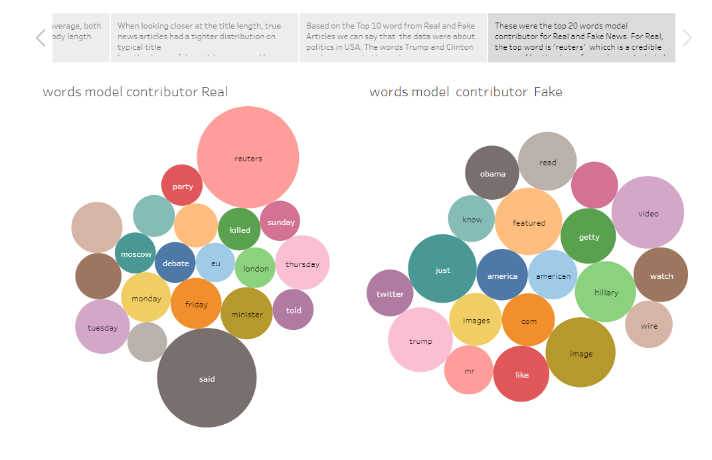

# Fake News Detector
## [**Click here to view the app**](https://detect-fake-news-app.herokuapp.com)

## This assumes you have Python/Jupyter Notebook installed and a way to create new Python environments
## Project Dcescription
The goal of this project is to create a model using machine learning that can determine whether an article is fake news or not. To interact with this model, a web page will be created that will allow a user to enter a article title/paragraph/URL and have the model determine whether that specific article is fake news or real news. An analysis will also be conducted to see what the characteristics of a fake news article are and compare to the characteristic of real news article and help make fake news more identifiable.

## Motivation
Fake news has become an issue in today’s climate, especially with the prevalence of social media and easily shareable content. Fake news can often spread quickly and can be taken as fact when it is bias and/or opiniated. It is also sometimes difficult/time consuming to determine what is fake news or not. This is why we have decided explore what makes fake news, fake news and how to distinguish it from real news.

## **Using the App**:
To get a prediction enter an article title or paragraph(s) in the input box and click go. To view the analysis click on the arrows on the dashboard.

## **Tools used**:
- Python (for data pre-processing and model creation)
- HTML (app Design)
- CSS (app styling)
- Tableau (to make the graphs)
- Heroku (for deploying the app)

## **Python Packages Used**:
- Pandas (for data pre-processing)
- Scikit-learn (for model creation)
- Flask (for app creation)
- nltk, spacy (for natural language processing)
- pickle (for model saving)

## **Conclusions**

## **Screenshots**
## **Before Article is entered**

## **After Article is entered (real prediction)**

## **After Article is entered (fake prediction)**

## **Analysis**

## **Running the app locally**
1. Before running any files create a new python environment
2. Run the following code in the terminal 
       
        pip install -r requirements.txt
        
3. Set you directory to where you cloned the repo
4. Run the following code in the terminal
        
        python app.py

5. In a web browser of your choosing, [click here](http://10.0.0.1:5000/), or enter this as the URL http://10.0.0.1:5000/

## **Running the jupyter notebooks**
1. Before running any of the jupyter notebooks please install the needed packages by running the following code in the terminal.

        pip install -r notebook_requirements.txt

2. Run the file *data_cleaning.ipynb* 

3. Run the file *logistic_reg_model_create.ipynb* 

4. Run the file *PA_model_create.ipynb*
